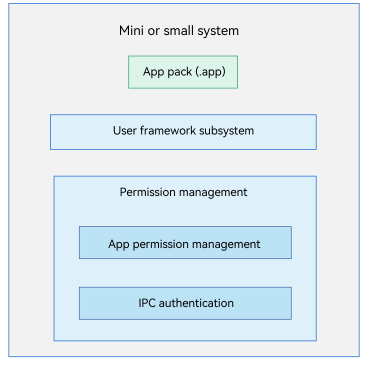

# App Permission Management

## Introduction

In OpenHarmony, apps and system services run in independent sandboxes. Both processes and data are isolated from each other to protect the security of app data. However, services or apps running in the sandboxes provide some APIs to implement specific functionalities. To access these APIs across processes, apps in other sandboxes need the required permissions, which are granted and managed based on a permission management mechanism.

App permission management provides the following features: 

-   Provides a mechanism for defining permissions, allowing system services and apps to define new permissions for their sensitive APIs. To access these APIs, other apps need the required permissions.

-   Allows apps to request permissions defined by the system or other applications. Upon obtaining the permissions, the apps can access the sensitive APIs provided by the system or other apps.
-   Allows users to view and manage the permission granting status.

**Figure 1** App permission management architecture




App permission management provides permission management for the app framework subsystem and provides APIs for apps to request permissions and query the permission granting status. The open-source app permission management applies to mini and small systems.

-   The mini system is designed for devices with memory larger than or equal to 128 KiB and equipped with MCU processors including ARM Cortex-M and 32-bit RISC-V. It provides a variety of lightweight network protocols, lightweight graphics frameworks, and IoT read/write components via bus. The mini system applies to smart home products, such as LinkIoT module devices, sensors and wearables.
-   The small system is oriented to devices with memory larger than or equal to 1 MiB and equipped with processors like ARM Cortex-A. It provides higher security capabilities, standard graphics frameworks, and video encoding and decoding. The small system applies to smart home products, such as IP cameras, peephole cameras, and routers as well as smart travel products, such as event data recorders (EDRs).

## Directory Structure

```
/base/security/permission_lite
├── interfaces                         # APIs
│   ├── innerkits                      # Internal APIs
│   └── kits                           # External APIs
└── services                           # Services
    ├── ipc_auth                       # IPC communication authentication
    ├── js_api                         # JS API encapsulation
    ├── pms                            # Permission management logic and server
    ├── pms_base                       # Service registration
    └── pms_client                     # Permission management client
```

## Usage

### Available APIs

The APIs for app permission management of the mini and small systems can be called only by system apps and services. The following table describes the APIs.

| API                                                      | Description                                              |
| ------------------------------------------------------------ | -------------------------------------------------- |
| int CheckPermission(int uid, const char *permissionName)     | Checks whether an app has the permission to access system service APIs.|
| int CheckSelfPermission(const char *permissionName)          | Checks whether the caller has the permission to access system service APIs.           |
| int QueryPermission(const char *identifier, PermissionSaved **permissions, int *permNum) | Queries all permissions requested by an app and checks whether the requested permissions have been granted.      |
| int GrantPermission(const char *identifier, const char *permName) | Grants a permission to an app.                            |
| int RevokePermission(const char *identifier, const char *permName) | Revokes a permission from an app.                            |
| int GrantRuntimePermission(int uid, const char *permissionName) | Grants a permission during the running of an app.                        |
| int RevokeRuntimePermission(int uid, const char *permissionName) | Revokes a permission during the running of an app.                        |
| int UpdatePermissionFlags(const char *identifier, const char *permissionName, const int flags) | Updates the flags of the permission specified by an app.                  |


The following table describes the APIs for IPC authentication of the mini and small systems.

| API                                                      | Description                                                        |
| ------------------------------------------------------------ | ------------------------------------------------------------ |
| int GetCommunicationStrategy(RegParams params, PolicyTrans **policies, unsigned int *policyNum) | Obtains the access policies for a service API. This API can be called only by System Ability Manager (SAMGR).     |
| int IsCommunicationAllowed(AuthParams params)                | Checks whether a process has the permission to access an API of another process. This API can be called only by SAMGR.|


### How to Use

**App Permission Management for a Mini or Small System**

The following uses the app permission development of the bundle manager service (BMS) as an example. Declare the required sensitive permissions in the **config.json** file during development. During app installation, the BMS calls APIs of the app permission management component to check whether the required permissions are available. If yes, the installation proceeds; otherwise, the installation fails.

1.  During development, determine and declare the permission (ohos.permission.INSTALL\_BUNDLE) required for installing the app.
    If the FA model is used, declare the permission in the **config.json** file. The following is an example:
    ```json
    {
      "module": {
          "package": "ohos.demo.kitframework",
          "deviceType": [
              "phone", "tv","tablet", "car","smartWatch","sportsWatch","smartCamera", "smartVision"
          ],
          "reqPermissions": [{
            "name": "ohos.permission.INSTALL_BUNDLE",
            "reason": "install bundle",
            "usedScene": {
              "ability": [
                "KitFramework"
                ],
              "when": "always"
            }
          },
          {
            "name": "ohos.permission.LISTEN_BUNDLE_CHANGE",
            "reason": "install bundle",
            "usedScene": {
              "ability": [
                "KitFramework"
                ],
              "when": "always"
            }
          },
          {
            "name": "ohos.permission.GET_BUNDLE_INFO",
            "reason": "install bundle",
            "usedScene": {
              "ability": [
                "KitFramework"
                ],
              "when": "always"
            }
          }
        ]
      }
    }
    ```
    If the stage model is used, declare the permission in **module.json5**. The following is an example:
    ```json
    {
      "module": {
        "requestPermissions": [{
          "name": "ohos.permission.INSTALL_BUNDLE",
          "reason": "install bundle",
          "usedScene": {
            "ability": [
              "KitFramework"
            ],
            "when": "always"
          }
        },
        {
          "name": "ohos.permission.LISTEN_BUNDLE_CHANGE",
          "reason": "install bundle",
          "usedScene": {
            "ability": [
              "KitFramework"
            ],
            "when": "always"
          }
        },
        {
          "name": "ohos.permission.GET_BUNDLE_INFO",
          "reason": "install bundle",
          "usedScene": {
            "ability": [
              "KitFramework"
            ],
            "when": "always"
          }
        }]
      }
    }
    ```

2.  When developing the app installation API, use the **CheckPermission()** API to check whether the BMS has the permission to install the application. For example, **CheckPermission()** is called with the permission name **ohos.permission.INSTALL\_BUNDLE** as the input parameter to check whether the BMS has the permission to install the app. If the BMS has the permission, the installation continues. Otherwise, the installation fails.

    ```c++
    constexpr static char PERMISSION_INSTALL_BUNDLE[] = "ohos.permission.INSTALL_BUNDLE";
    
    bool Install(const char *hapPath, const InstallParam *installParam, InstallerCallback installerCallback)
    {
        if ((hapPath == nullptr) || (installerCallback == nullptr) || (installParam == nullptr)) {
            HILOG_ERROR(HILOG_MODULE_APP, "BundleManager install failed due to nullptr parameters");
            return false;
        }
        // Check whether the ohos.permission.INSTALL_BUNDLE permission has been granted.
        if (CheckPermission(0, static_cast<const char *>(PERMISSION_INSTALL_BUNDLE)) != GRANTED) {
            HILOG_ERROR(HILOG_MODULE_APP, "BundleManager install failed due to permission denied");
            return false;  // App installation fails.
        }
        // Installation process.
        ...
    }
    ```


**IPC Authentication for a Mini or Small System**

The following example describes how to use the IPC authentication component to configure the policies for accessing the BMS feature. In this example, the service registered by the BMS with SAMGR is **bundlems**, and the feature registered is **BmsFeature**.

1. Configure the access policy in the header file **base/security/permission\_lite/services/ipc\_auth/include/policy\_preset.h** in the source code directory. There are three types of access policies:

    - **RANGE**: allows access from the processes with UIDs in the specified range. **uidMin** and **uidMax** must be specified.
    - **FIXED**: allows access from the processes with the specified UIDs. **fixedUid** must be specified, and a maximum of eight UIDs are allowed.
    - **BUNDLENAME**: allows access from the specified app. **bundleName** must be specified.

    ```c++
    FeaturePolicy bmsFeature[] = {
        {
            "BmsFeature",
            {
                {
                    .type=FIXED,    // Allow access from the processes with the specified UIDs.
                    .fixedUid={2, 3, 8}
                },
                {
                    .type=RANGE,    // Allow access from the processes with UIDs in the specified range.
                    .uidMin=100,
                    .uidMax=__INT_MAX__,
                },
            }
        },
        {
            "BmsInnerFeature",
            {
                {
                    .type=FIXED,    // Allow access from the processes with the specified UIDs.
                    .fixedUid={2, 3, 8}
                },
                {
                    .type=RANGE,
                    .uidMin=100,
                    .uidMax=999,
                },
            }
        },
    };
    ```

2. Add the policies configured for the features in Step 1 to the global policy settings. You need to set the number of features.

    ```c++
    static PolicySetting g_presetPolicies[] = {
        {"permissionms", pmsFeature, 1},
        {"abilityms", amsFeature, 2},
        {"bundlems", bmsFeature, 2}, // BMS feature defined in step 1. The number of BMS features is 2.
        {"dtbschedsrv", dmsFeature, 1},
        {"samgr", samgrFeature, 1},
        {"appspawn", appspawnFeature, 1},
        {"WMS", wmsFeature, 1},
        {"bundle_daemon", bdsFeature, 1},
    };
    ```

3. Register the **BmsFeature** defined in Step 1 with SAMGR.

    ```c++
    const char BMS_SERVICE[] = "bundlems";
    const char BMS_FEATURE[] = "BmsFeature";
    static void Init()
    {
        SamgrLite *sm = SAMGR_GetInstance();
        if (sm == nullptr) {
            return;
        }
        // Register the service with SAMGR.
        sm->RegisterFeature(BMS_SERVICE, reinterpret_cast<Feature *>(BundleMsFeature::GetInstance()));
        sm->RegisterFeatureApi(BMS_SERVICE, BMS_FEATURE,
            GetBmsFeatureApi(reinterpret_cast<Feature *>(BundleMsFeature::GetInstance())));
        HILOG_DEBUG(HILOG_MODULE_APP, "BundleMS feature start success");
    }
    APP_FEATURE_INIT(Init);
    ```


When the specified services are registered with SAMGR, SAMGR calls **GetCommunicationStrategy()** of the IPC authentication component to obtain the access policy for the services. When other services or apps access these services over IPC, SAMGR calls **IsCommunicationAllowed()** of the IPC authentication component to check the permission of the caller service. If the access policy is met, the access is allowed. Otherwise, the access is rejected.

## Repositories Involved
Security subsystem

**[security\_permission\_lite](https://gitee.com/openharmony/security_permission_lite)**